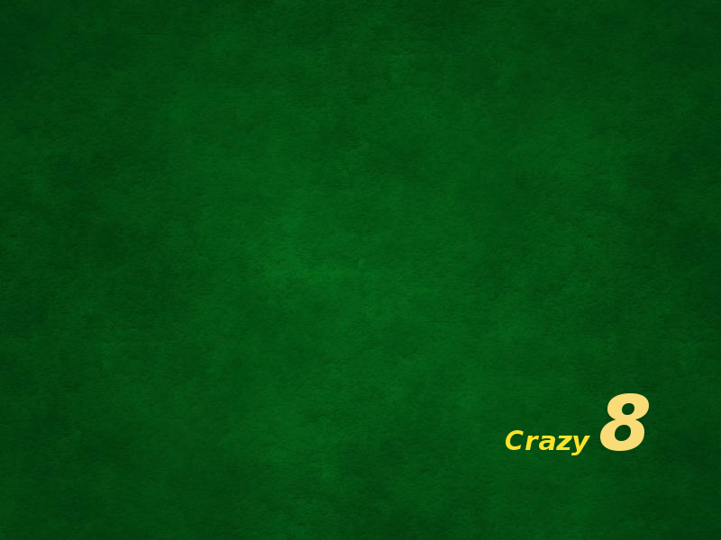

# 🃏 Crazy8s

Juego de cartas clásico **Crazy Eights** (también conocido como "8 locos") implementado en **Python + Kivy**.



## ✨ Características

- Interfaz gráfica moderna con Kivy
- Soporte para **jugadores humanos + bots**
- Configuración flexible: número de jugadores, humanos y velocidad de autoplay
- Baraja francesa con imágenes de cartas
- Reglas completas de Crazy 8s (incluyendo cambio de palo con 8)
- Pruebas unitarias independientes de Kivy

## 📋 Requisitos

- Python 3.12+
- Kivy 2.3.0 o superior
- (Recomendado) Entorno virtual

## 🚀 Instalación y ejecución

### 1. Clona el repositorio

```bash
git clone <tu-repo>
cd crazy8s
```

### 2. Crea el entorno virtual e instala dependencias

```bash
python3 -m venv .venv
./.venv/bin/pip install -r requirements.txt
```

### 3. Ejecuta el juego (recomendado)

```bash
./run.sh
```

O manualmente:

```bash
./.venv/bin/python main.py
```

### 4. Prueba rápida (sin Kivy)

```bash
python test_cards_players.py
```

## 🎮 Cómo jugar

1. Al iniciar verás una pantalla de splash.
2. En la pantalla de configuración elige:
   - Número total de jugadores (2-6)
   - Cuántos son humanos
   - Si quieres que los bots jueguen solos (autoplay)
   - Velocidad del autoplay
3. Durante el juego:
   - Haz clic en una carta válida de tu mano para jugarla
   - Si no puedes jugar, pasa (el botón aparece cuando es tu turno)
   - Cuando juegues un **8**, elige el palo siguiente

## 📁 Estructura del proyecto

```
crazy8s/
├── main.py                 # Aplicación principal (Kivy)
├── cards.py                # Lógica de cartas y baraja
├── players.py              # Clase Player y creación de listas
├── crazy8s.kv              # Definición de UI con Kivy
├── requirements.txt
├── run.sh                  # Script de lanzamiento con .venv
├── test_cards_players.py   # Pruebas rápidas sin Kivy
├── img/                    # Imágenes de cartas y fondos
├── legacy/                 # Versiones anteriores (histórico)
└── .venv/                  # Entorno virtual (ignorado en git)
```

## 🧪 Desarrollo

- El juego está fijado a ventana de **800x600** (no redimensionable)
- Usa `FrenchDeck.loadimages()` para cargar las cartas
- Los bots usan lógica simple de ranking de cartas

## 📜 Licencia

Proyecto personal / educativo. Libre para uso y modificación.

---

**Versión:** 1.0  
**Motor:** Kivy 2.3+
